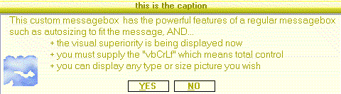



## Custom GlassBox MessageBox \(update\)   6 different "skins" sounds support and more \(screenshot movie\)

### Description

A custom message box with 6 differents "skins" (GlassRed, GlassCandy, GlassOrange, Glassblue, GlassWhite, GlassYellow) use any (or none) icon/bmp for the messagebox..any size you wish, an offsetX and offsetY for exact placement of your messagebox picture, and the ability to play either exclamation, or warning sound, or a custom sound of your choice(or no sound at all) and best of all..it looks real nice)
 
### More Info
 

             |
---                |---
**Submitted On**   |2005-02-16 22:13:08
**By**             |[Evan Toder](https://github.com/Planet-Source-Code/PSCIndex/blob/master/ByAuthor/evan-toder.md)
**Level**          |Intermediate
**User Rating**    |4.5 (45 globes from 10 users)
**Compatibility**  |VB 3\.0, VB 4\.0 \(16\-bit\), VB 4\.0 \(32\-bit\), VB 5\.0, VB 6\.0
**Category**       |[Custom Controls/ Forms/  Menus](https://github.com/Planet-Source-Code/PSCIndex/blob/master/ByCategory/custom-controls-forms-menus__1-4.md)
**World**          |[Visual Basic](https://github.com/Planet-Source-Code/PSCIndex/blob/master/ByWorld/visual-basic.md)
**Archive File**   |[Custom\_Gla1853802162005\.zip](https://github.com/Planet-Source-Code/evan-toder-custom-glassbox-messagebox-update-6-different-skins-sounds-support-and-more-scr__1-58960/archive/master.zip)

